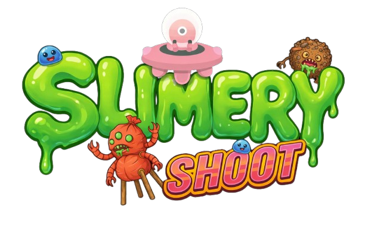
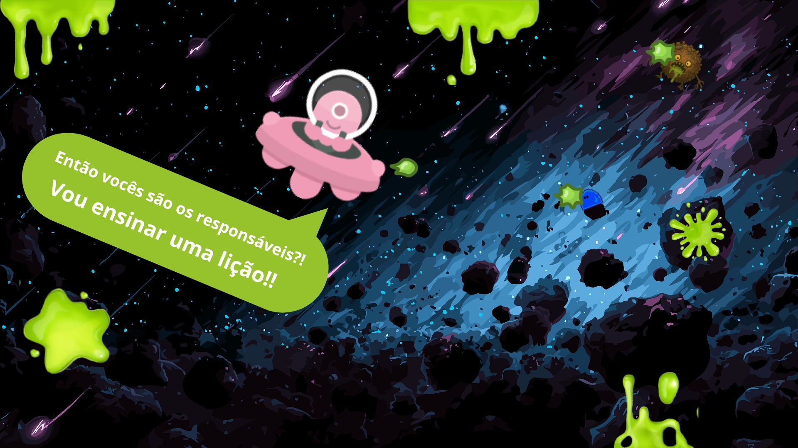
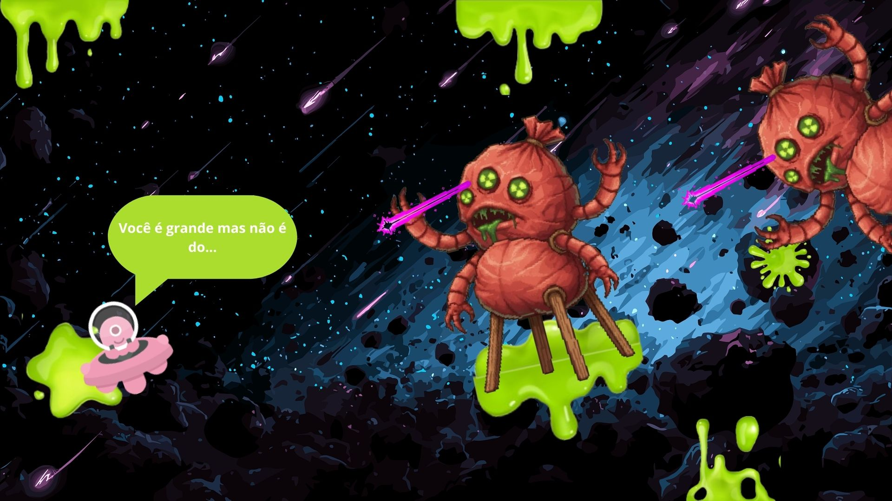
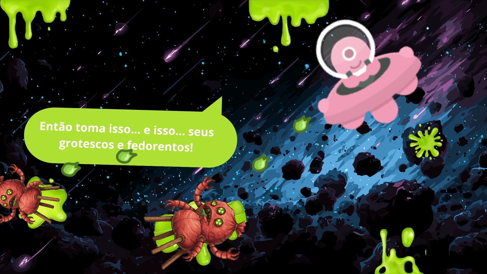
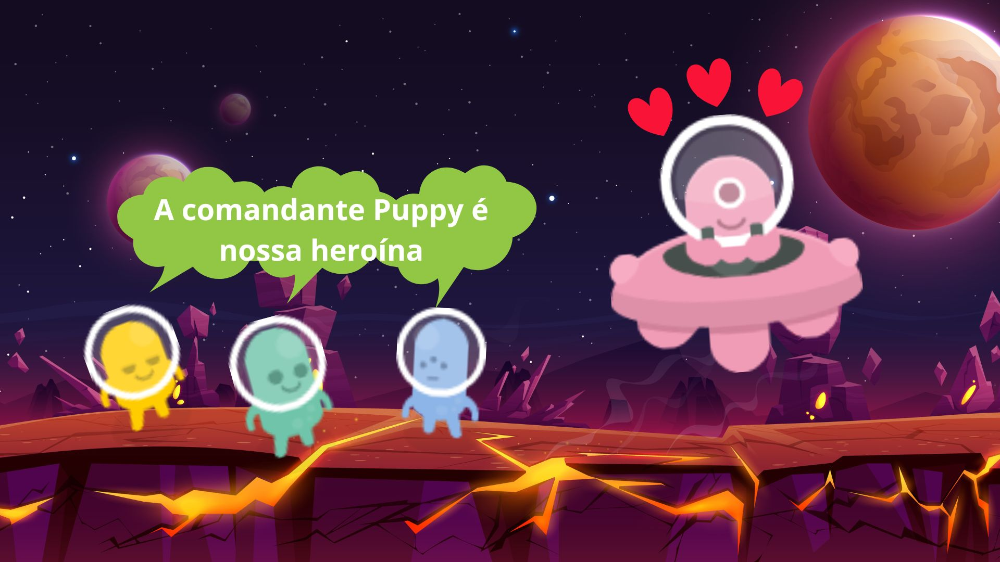
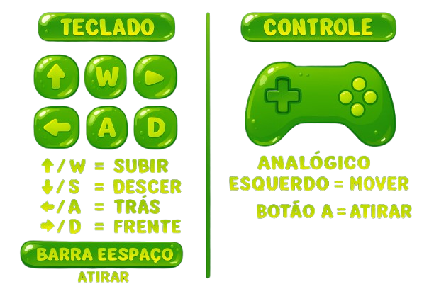

  

**Esse é o jogo 2d criado na plataforma do Unity usando a linguagem C#. É um estudo de caso para a disciplina de Game Development no curso de Análise e Desenvolvimento de Sistemas da Unifecaf**

  
  
 

 **A comandante Puppy é uma alienígena que navega entre mundos e, em uma dessas viagens percebeu que tinha algo estranhamente gosmento em alguns mundos de uma determinada região. Essa região foi dominada por monstros nojentos feitos de lixo e slime. Esses monstros, o Slime Trash Monster e o Blue Slime, não foram sempre assim, já foram slimes livres e felizes nos seus mundos, porém, foram capturados pelo Boss Monster, que os obrigou a misturarem lixo e slime jogados pelos planetas em suas órbitas e transformar numa arma poderosa que meleca e paralisa tudo que toca. Mas a comandante Puppy é uma super heroína muito corajosa e com sua super nave e inteligência, conseguirá derrotar os monstros.
 O jogo é uma parte dessa estória, a comandante Puppy deve atirar nos Slime Trash Monsters, coletar Blue Slimes e derrotar os Boss Monsters, sim são "Bosses", porque ele tem o poder de se multiplicar, é nessa super aventura que o(a) jogador(a) passa pelas fases e em cada fase sobe um nível de dificuldade. E ao final dessa batalha a Puppy e o(a) jogador(a) podem comemorar junto aos seus amigos!**

 **Esse é o terceiro jogo que monto em minha tragetória de estudante de tecnologia, porém usando as ferramentas Unity, Visual Studio e a linguagem C#, que foram as ferramentas utilizadas para criar esse jogo, é a minha estreia.**

   

 
 A cena de menu possui box de informação sobre como jogar e a tecla de play.

 
 O jogo possui três fases, na primeira fase o(a) jogador(a) deve acertar uma quantidade de  Slime Trash Monsters, os Slime Trash Monsters não atiram mas se o(a) jogador(a) deixar que eles se amontoem ao seu redor a comandante Puppy morrerá. 
 

    
 

 
 Na segunda fase o(a) jogador(a) deve acertar os Slime Trash Monsters e coletar Blue Slimes.
 

    
 

 
 Na terceira fase, além de ter que acertar os Slime Trash Monsters, coletar os Blue Slimes, deve derrotar o Boss Monster que se multiplica e que atira raio pelo seu olho central.
 

   
 

 E ao final duas telas dependendo do resultado. Se o jogador perder, ela vai para a tela de game over onde ele pode escolher se vai jogar novamente o mesmo nível que estava ou reiniciar o jogo pelos botões de Menu e Replay.
 

   
 

Já na  cena de vitória, há uma pequena animação, com os personagens, uma mensagem central e o botão Menu, onde é possível reiniciar o jogo.

   

 O jogo possui mecânica simples, o player se movimenta para cima  e para baixo, para a direita e para a esquerda. Não possui gravidade por ser uma nave espacial. Os inimigos perseguem o player pela tela, 
 

   
 

 Pode ser jogado pelo teclado, através da teclas de letras e as setas e pelo console.

 As cenas jogáveis possuem texto informativo no início direcionando o(a) jogador(a) para quais são os objetivos, tem slider de vidas para o player e o Boss Monster, possui textos indicadores de quantidade acertada / coletada de inimigos. O player fica alguns segundos em stand by sem poder atirar após vinte tiros, nesse tempo só é possível desviar dos inimigos e perigos, e isso é sinalizado com um ícone de slime, que é a munição do player.

 O jogo possui feedback visual com mudança de cores, blinks e sons, de atrito e morte e, trilha sonora(uma música para cada  momento do jogo.

 O jogo pode ser acessado [aqui](url) e, por enquanto, somente via web.
 
 
